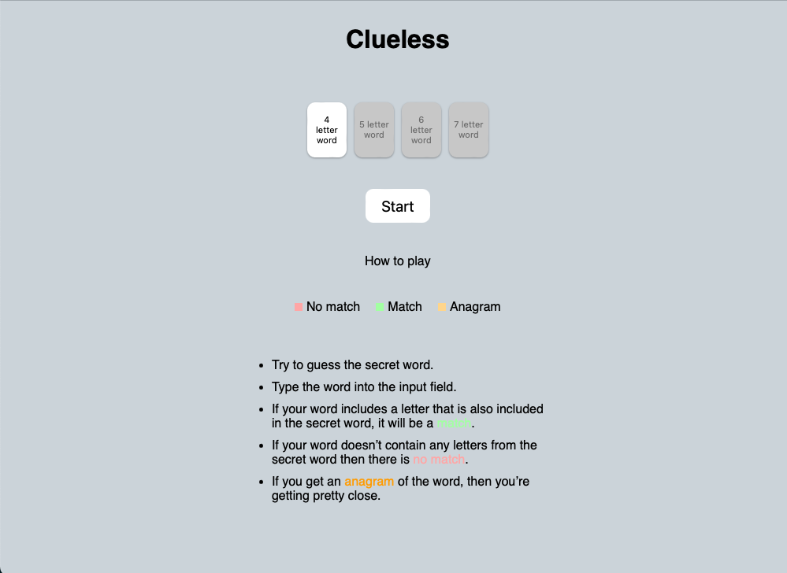
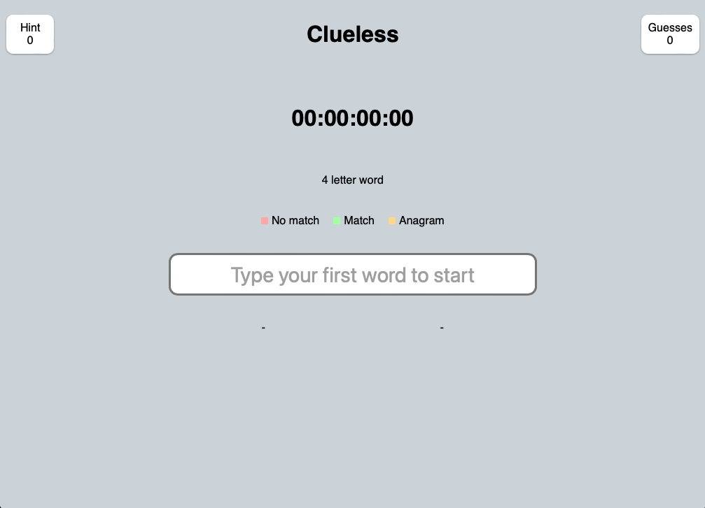
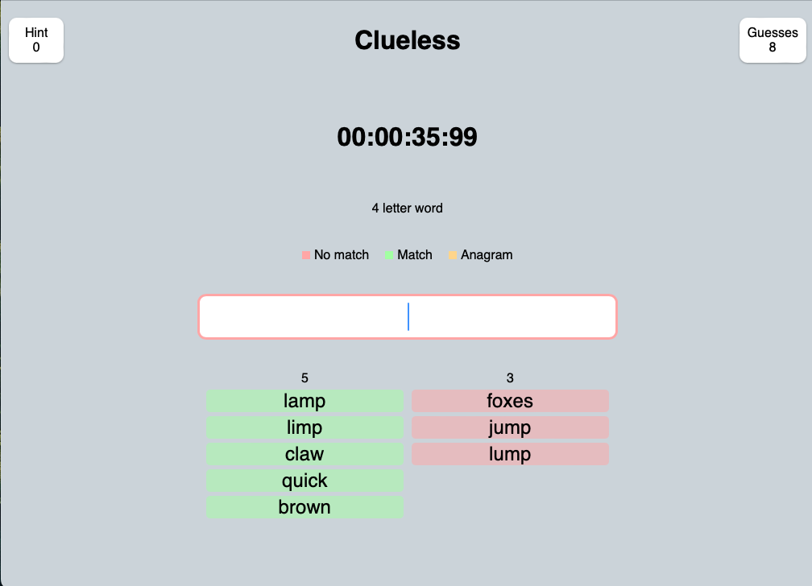
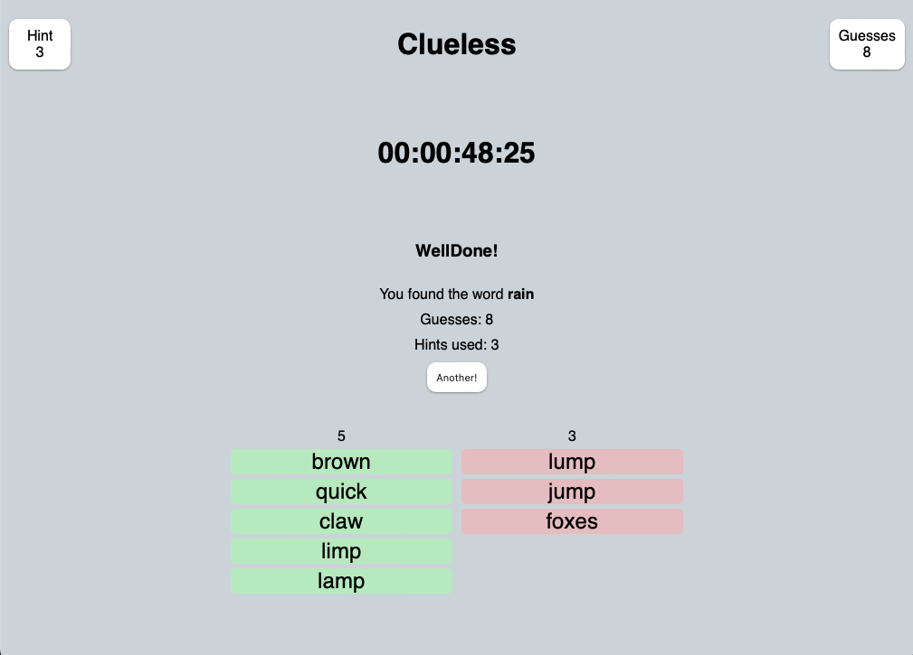

# Clueless

---

## About this project

As far as I can tell, this is the first instance of this game on the internet. Clueless is a word puzzle game that I designed and developed where users have to guess a secret word by typing in any word (4 letters minimum) and if that word contains a letter that is also included in the secret word, the word is a MATCH else its NO MATCH.  Users can then narrow down the letters in the secret word.  However, finding words that don’t include letters you’ve already guessed can get quite tricky. 

Despite just being a simple single page application, I designed the logic behind it to ensure a fun game that is always possible to win with an infinite possibility of paths to achieve a win. 

---

## Technologies

JS

CSS

React

---
## Live Link

https://cluelessv1.vercel.app

---

## Screenshots

### Picture 1

### Picture 2

### Picture 3

### Picture 4

